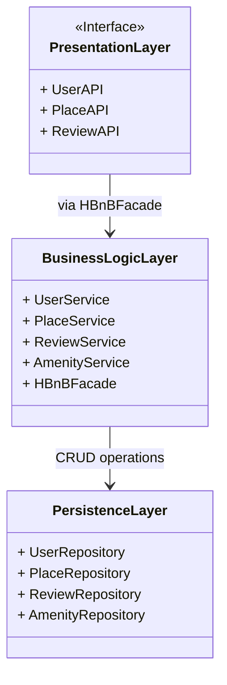

## 🧩 High-Level Package Diagram – HBnB Application

This diagram illustrates the **three-layer architecture** of the HBnB application and how these layers interact using the **Facade Pattern**.

📦 1. Presentation Layer
Role: Interface between users and the system.

Components: UserAPI, PlaceAPI, ReviewAPI.

Responsibility: Handles client requests, authentication, and validation.

🧠 2. Business Logic Layer
Role: Contains the main application logic.

Components: UserService, PlaceService, ReviewService, AmenityService, and HBnBFacade.

Responsibility: Processes data, applies business rules, and interfaces with persistence.

💾 3. Persistence Layer
Role: Manages data storage and access.

Components: UserRepository, PlaceRepository, ReviewRepository, AmenityRepository.

Responsibility: Performs CRUD operations on the database.

🧱 Facade Pattern
The HBnBFacade acts as a unified interface between the Presentation Layer and the Business Logic Layer. It simplifies interaction and decouples the components, promoting maintainability and scalability.
