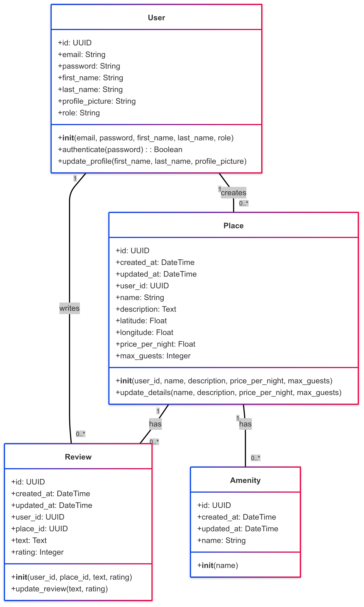

## 🧱 Business Logic Layer – Class Diagram

The following UML class diagram represents the core business entities of the HBnB application and their relationships:

- User can create Places and write Reviews.
- Places can have Reviews and Amenities.

---

### 1. Description of Each Entity:

#### 🧍‍♂️ User:
**Role:** Represents a user of the HBnB application. A user can have one of two roles: `"regular user"` or `"administrator"`.

**Key Attributes:**
- `id`: Unique identifier for the user.
- `email`: User's email address (used for login).
- `password`: User's password (stored securely, likely hashed).
- `first_name`, `last_name`: User's name.
- `profile_picture`: Link or path to the user's profile picture.
- `role`: Indicates the user's role.

**Key Methods:**
- `__init__()`: Constructor to create a new user.
- `authenticate()`: Verifies the user's password.
- `update_profile()`: Updates the user's profile information.

---

#### 🏠 Place:
**Role:** Represents a property listed by a user.

**Key Attributes:**
- `id`, `created_at`, `updated_at`
- `user_id`: Foreign key referencing the user
- `name`, `description`, `latitude`, `longitude`
- `price_per_night`, `max_guests`

**Key Methods:**
- `__init__()`, `update_details()`

---

#### 📝 Review:
**Role:** Represents user feedback for a place.

**Key Attributes:**
- `id`, `created_at`, `updated_at`
- `user_id`, `place_id`: Foreign keys
- `text`, `rating`

**Key Methods:**
- `__init__()`, `update_review()`

---

#### 🧰 Amenity:
**Role:** Represents an additional feature for a place.

**Key Attributes:**
- `id`, `created_at`, `updated_at`, `name`

**Key Methods:**
- `__init__()`

---

### 2. Explanation of Relationships:

- **User creates Place:**  
  A `User` can create (list) zero or more `Places`.  
  This is shown by the association with multiplicity: `1` on the User side and `0..*` on the Place side.  
  The `Place` class has a `user_id` foreign key.

- **User writes Review:**  
  A `User` can write zero or more `Reviews`.  
  Represented by: `1` (User) → `0..*` (Review).  
  The `Review` class uses `user_id`.

- **Place has Review:**  
  A `Place` can receive many `Reviews`, with the foreign key `place_id` in the `Review` class.

- **Place has Amenity:**  
  A `Place` can have many `Amenities`, showing `1` (Place) → `0..*` (Amenity).
