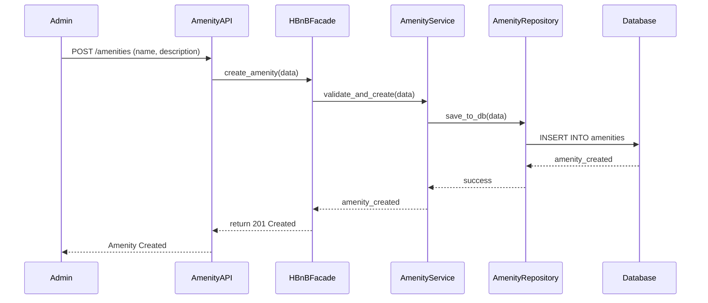

## ✅ API Call: Create New Amenity

This sequence diagram shows how an admin creates a new amenity (e.g., Wi-Fi, Pool) in the HBnB system.  
It demonstrates how the request flows from the API (Presentation Layer), through the business logic, and down to the persistence layer (Database).

📝 Explanation:
Admin submits a POST request to create a new amenity (e.g., "Wi-Fi").

The request hits the AmenityAPI, part of the Presentation Layer.

The HBnBFacade forwards the request to AmenityService, which handles business logic.

The service validates the data and sends it to the AmenityRepository.

The repository stores the data in the Database.

A success response (201 Created) is returned all the way back to the admin.

✅ This diagram completes the documentation of all core entities in HBnB:

User

Place

Review

Amenity
