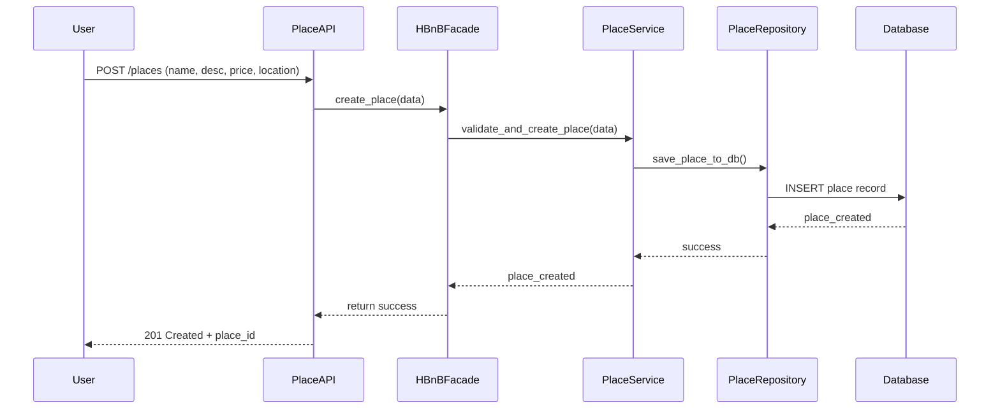

## API Call: Create New Place

This sequence diagram shows how a user creates a new place listing in the HBnB application, from the initial API request down to database storage.

### Explanation:

1. **User** submits a request to create a new place via the API.
2. **PlaceAPI** sends the data to the **HBnBFacade**, which acts as a bridge to the business logic.
3. **HBnBFacade** forwards the data to **PlaceService**, responsible for validation and creation logic.
4. **PlaceService** uses **PlaceRepository** to save the place into the **Database**.
5. Once the database confirms, the success message travels back up to the user with the new place ID.
