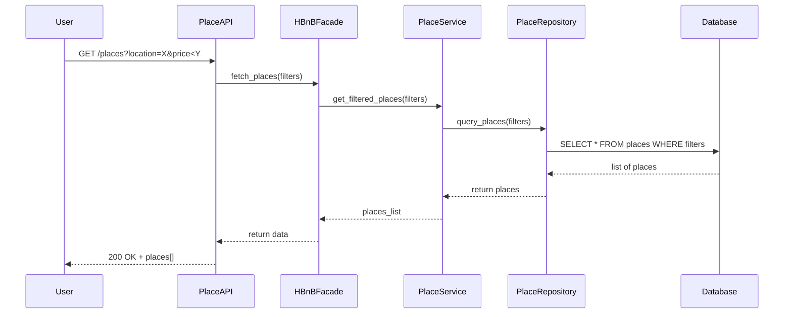

## API Call: Get Places List

This sequence diagram shows how the system processes a request to fetch a list of available places, including how filters are handled and data is retrieved from the database.

### Explanation:

1. **User** submits a request to fetch a list of places, possibly with filters like location or price.
2. **PlaceAPI** sends the request to the **HBnBFacade**, which acts as a bridge to the business logic.
3. **HBnBFacade** forwards the request to **PlaceService**, responsible for processing the logic.
4. **PlaceService** uses **PlaceRepository** to query the filtered list from the **Database**.
5. Once the data is retrieved, the list of places is returned through the layers back to the user.

