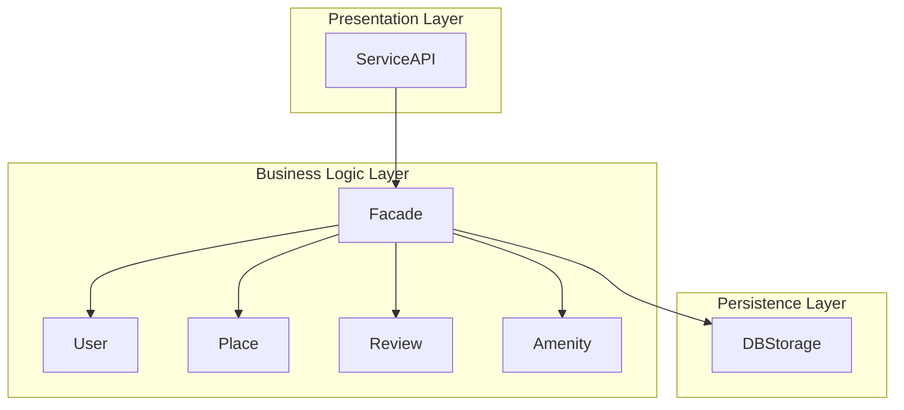
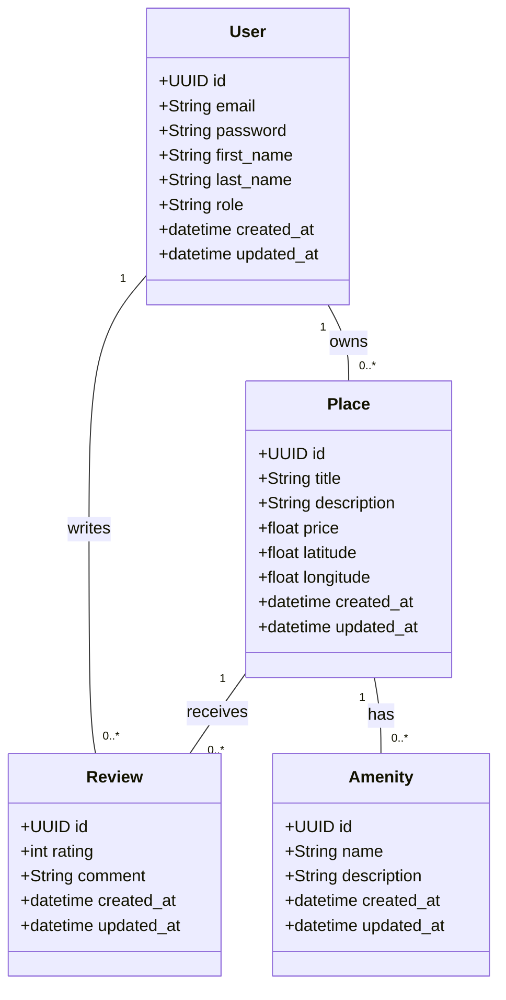
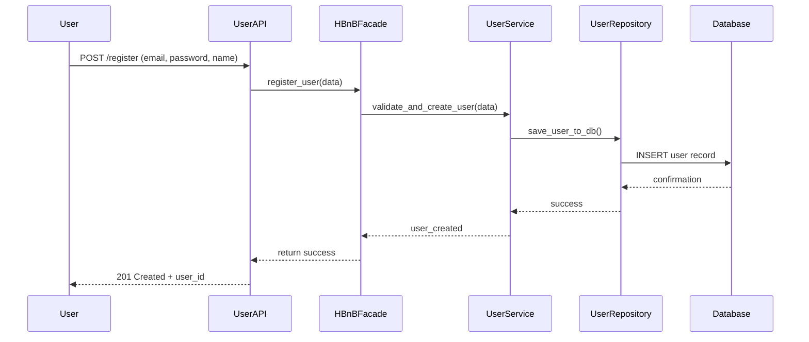
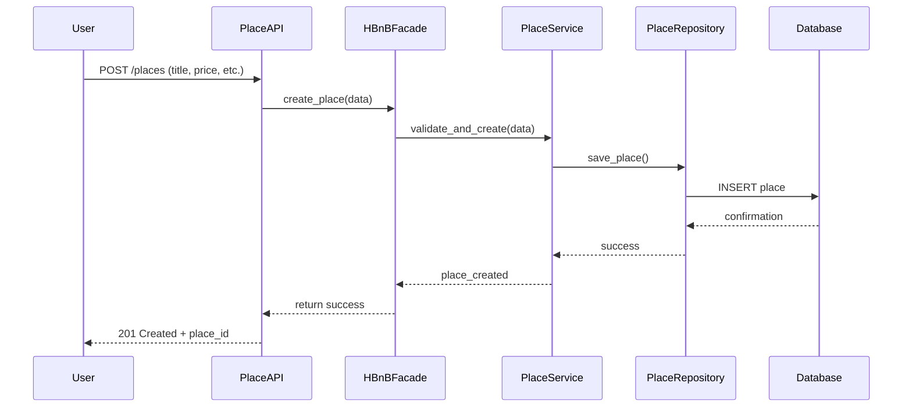
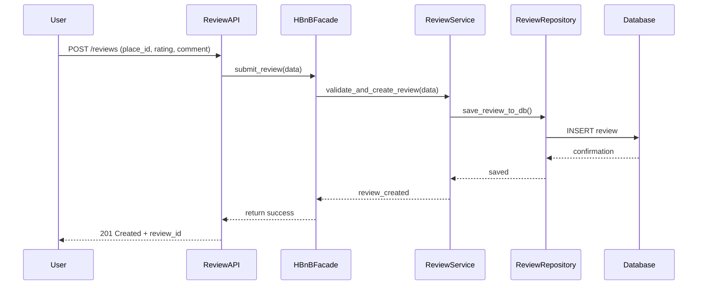
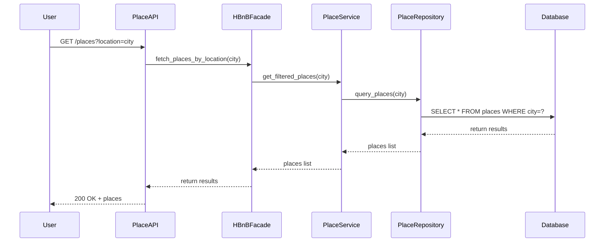
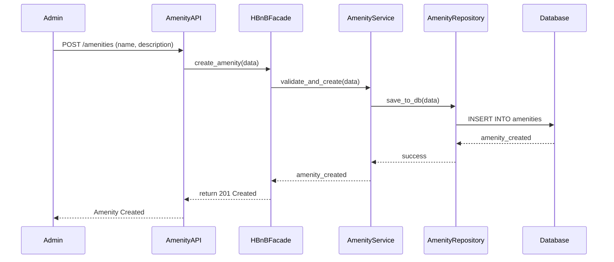
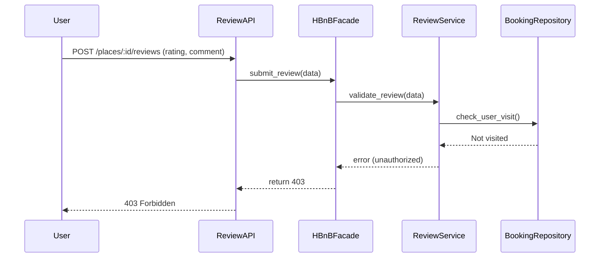
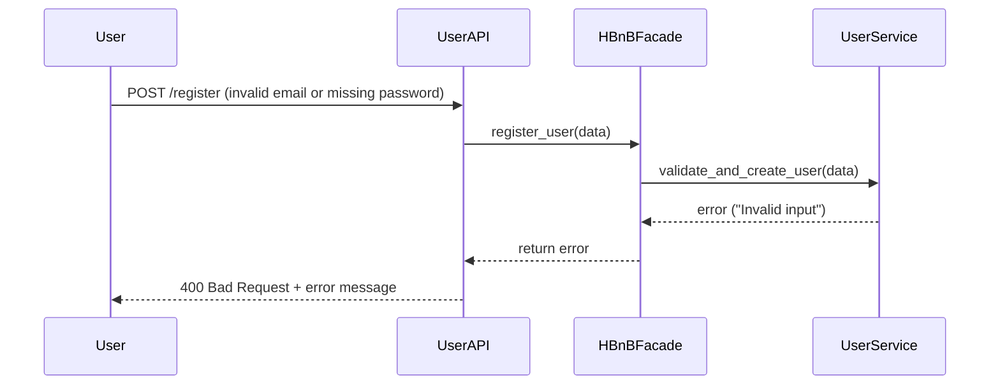
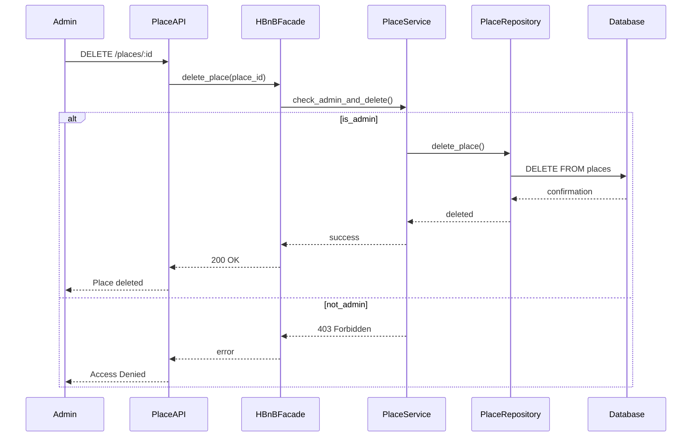

## HBnB Evolution - Technical Documentation

### 📌 Introduction

This document outlines the core architectural and design components of the HBnB Evolution project, a simplified version of an AirBnB-like application. It compiles all technical diagrams and notes to guide the implementation phase and ensure clear understanding of the system.

---

### 🧱 High-Level Architecture

#### 📦 Package Diagram:

#### 📝 Explanation:

* **Presentation Layer**: Interfaces where users interact with the system through APIs or UIs.
* **Business Logic Layer**: Contains the core app logic, including entities and rules.
* **Persistence Layer**: Handles communication with the database.
* **Facade Pattern**: Simplifies interaction between presentation and logic layers.

---

### 📚 Business Logic Layer - Class Diagram

#### 📝 Explanation:

Each class includes essential attributes like ID, creation/update time, and relationships.

---

### 🔁 API Interaction Flow (Sequence Diagrams)

#### 1.Register New User

- **Purpose**: Allows a new user to create an account.

### Explanation:

1. User submits registration.
2. Facade handles logic.
3. User is saved to DB.

---

#### 2.Create New Place

- **Purpose**: Allows a user to list a new property.

### Explanation:

1. User creates a place.
2. Data validated and stored.
3. Confirmation returned.

---

### 3.Submit Review

- **Purpose**: Enables users to submit a review for a place.

**Explanation:**
1. The user submits a review via the API.
2. The request goes through the business logic and gets saved.
3. Confirmation is returned to the user.

---

### 4. Get List of Places  

- **Purpose**: Retrieve a list of available places.

**Explanation:**
1. User requests places in a city.
2. The API forwards the query to the facade.
3. The business logic retrieves matching places from the DB.
4. Response is sent back to the user.

---

## 🧩 Additional Sequence Diagrams (Optional but valuable)

### 5. Create Amenity  

- **Purpose**: Admin can add a new amenity (e.g., Wi-Fi).

#### 6.Review Submission Failed (Unauthorized)

- **Purpose**: Shows possible outcomes (success or 403 forbidden).

### Explanation:

1. User tries to submit a review.
2. System checks visit.
3. Returns 403 if not allowed.

---

### 7.Failed Registration (Invalid Input)

- **Purpose**: Shows what happens when user registration fails.

**Explanation:**
1. Invalid data is sent to register.
2. Validation fails and error is returned.
3. User gets a 400 Bad Request response.

---

#### 8.Admin Deletes Place

- **Purpose**: Admin deletes a place listing.

### Explanation:

* If admin: place is deleted.
* If not admin: system denies access.

---

---

## ✅ Final Summary

This document summarizes the technical design and architecture of the HBnB Evolution project, completed as part of our training with **Holberton School – Tuwaiq Academy**.

It includes high-level architecture, detailed class structure, and API interaction flows, covering all core components of the system.

> Prepared with the collaboration of team members: **Batoul Alsaeed**, **Miad Alzhrani**, and **Rawan Albaraiki**.

This documentation is intended to guide the implementation phases and serve as a reference throughout the development process.
