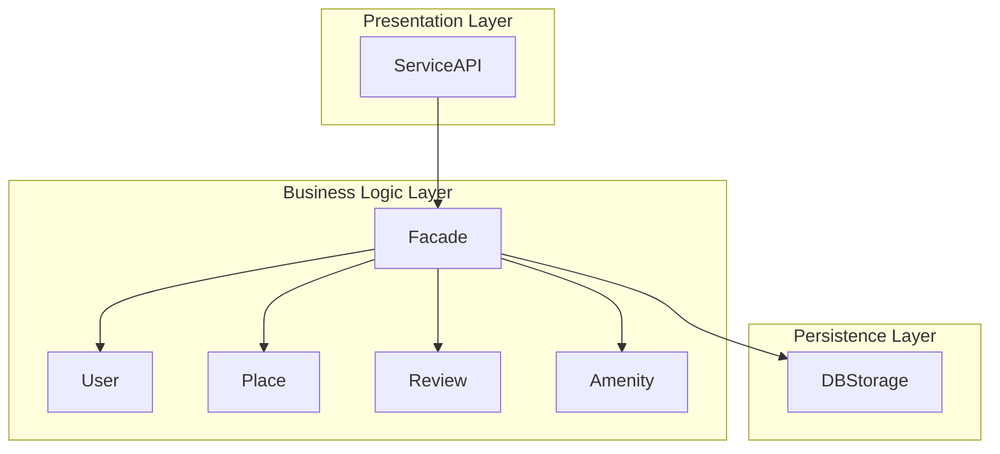
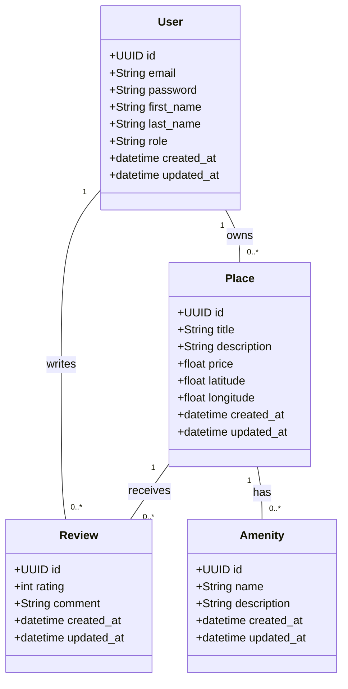
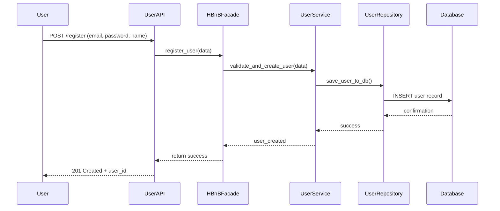
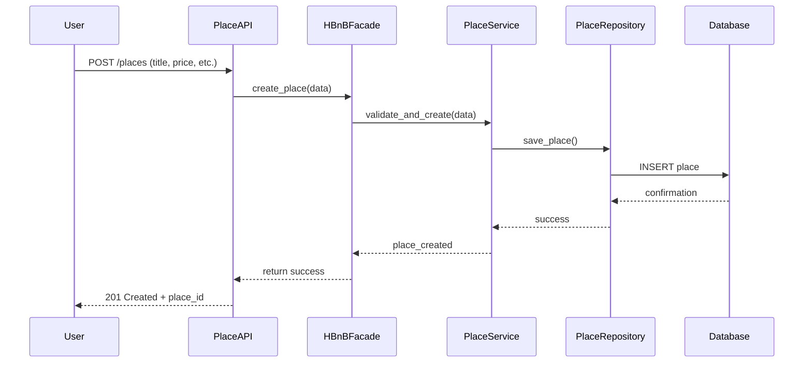
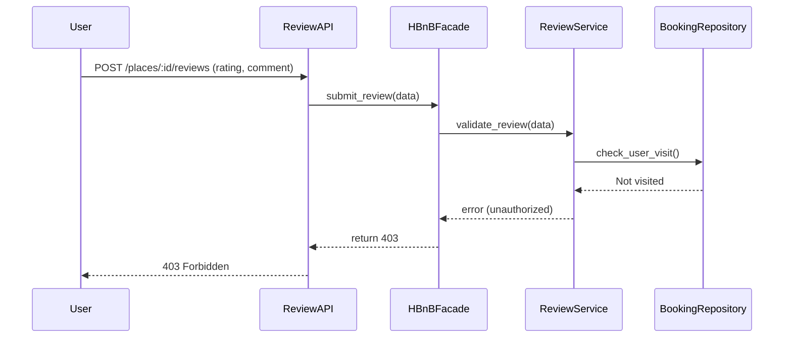
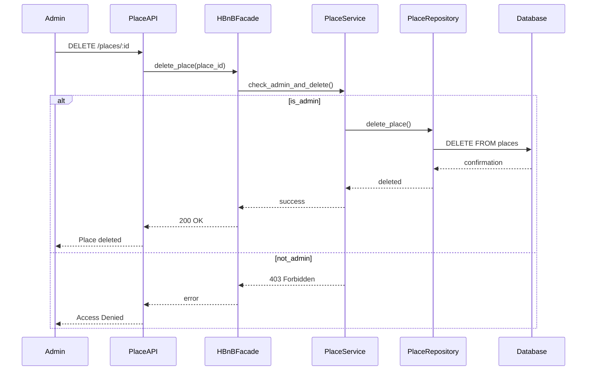
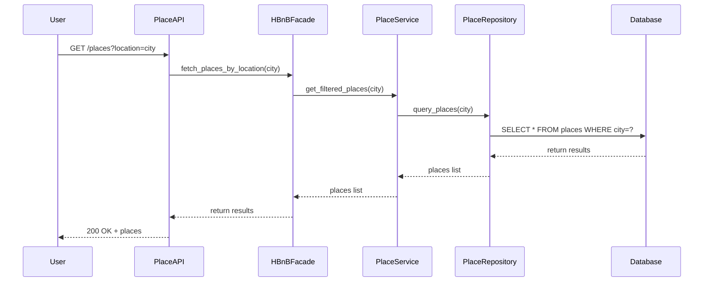
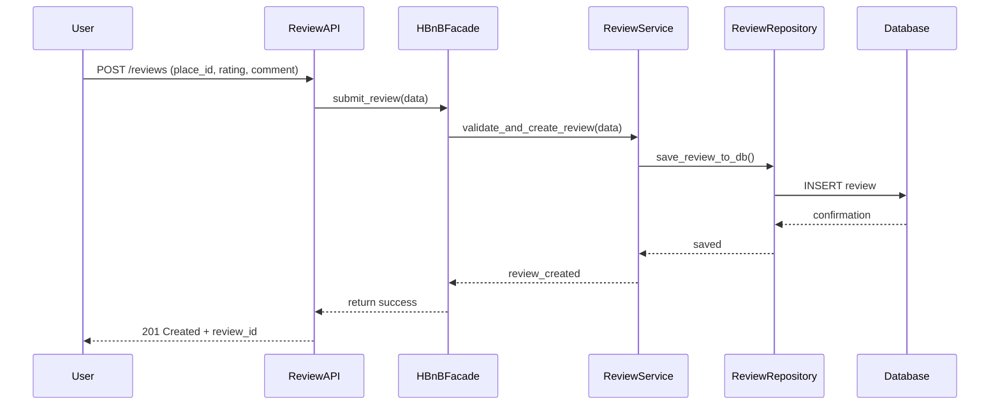
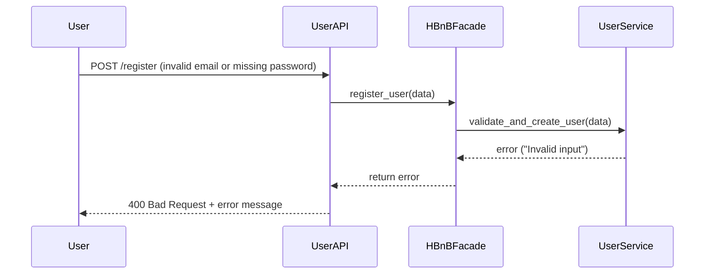

## HBnB Evolution - Technical Documentation

### 📌 Introduction

This document outlines the core architectural and design components of the HBnB Evolution project, a simplified version of an AirBnB-like application. It compiles all technical diagrams and notes to guide the implementation phase and ensure clear understanding of the system.

---

### 🧱 High-Level Architecture

#### 📦 Package Diagram:

#### 📝 Explanation:

* **Presentation Layer**: Interfaces where users interact with the system through APIs or UIs.
* **Business Logic Layer**: Contains the core app logic, including entities and rules.
* **Persistence Layer**: Handles communication with the database.
* **Facade Pattern**: Simplifies interaction between presentation and logic layers.

---

### 📚 Business Logic Layer - Class Diagram

#### 📝 Explanation:

Each class includes essential attributes like ID, creation/update time, and relationships.

---

### 🔁 API Interaction Flow (Sequence Diagrams)

#### ✅ Register New User

### Explanation:

1. User submits registration.
2. Facade handles logic.
3. User is saved to DB.

---

#### ✅ Create New Place

### Explanation:

1. User creates a place.
2. Data validated and stored.
3. Confirmation returned.

---

#### ❌ Review Submission Failed (Unauthorized)

### Explanation:

1. User tries to submit a review.
2. System checks visit.
3. Returns 403 if not allowed.

---

#### ✅ Admin Deletes Place

### Explanation:

* If admin: place is deleted.
* If not admin: system denies access.

---

### ✅ API Call: Fetch List of Places

**Explanation:**
1. User requests places in a city.
2. The API forwards the query to the facade.
3. The business logic retrieves matching places from the DB.
4. Response is sent back to the user.

---

### 📝 API Call: Submit Review

**Explanation:**
1. The user submits a review via the API.
2. The request goes through the business logic and gets saved.
3. Confirmation is returned to the user.

---

### ❌ API Call: Failed Registration (Invalid Input)

**Explanation:**
1. Invalid data is sent to register.
2. Validation fails and error is returned.
3. User gets a 400 Bad Request response.
---

✅ End of Technical Document
