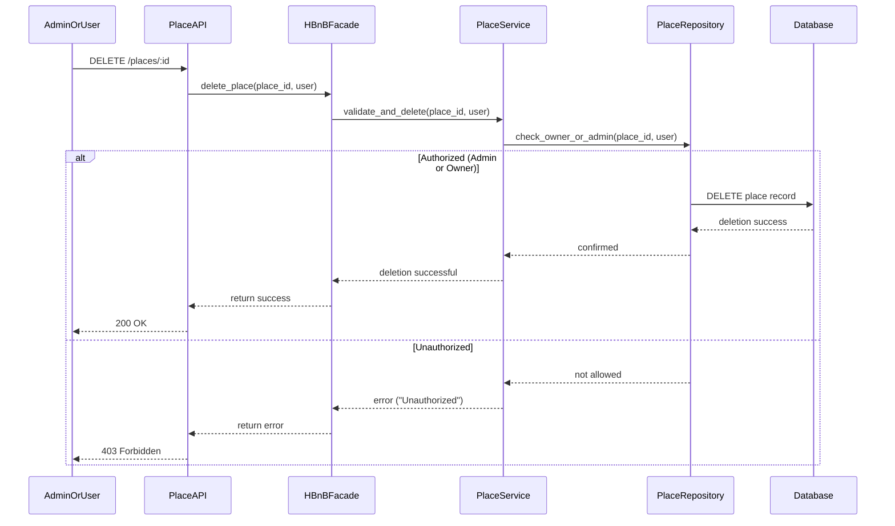

## API Call: Admin Deletes a Place (Success or Unauthorized)

This sequence diagram shows how the system handles deleting a place, including permission validation for admins or owners.

### Explanation:
1. The Admin or User sends a request to delete a place.
2. PlaceAPI forwards the request to the Facade, which passes it to PlaceService.
3. PlaceService checks permissions using PlaceRepository.
4. If the user is the owner or an admin, the place is deleted from the Database and a 200 OK response is sent.
5. If not authorized, a 403 Forbidden error is returned to the user.
