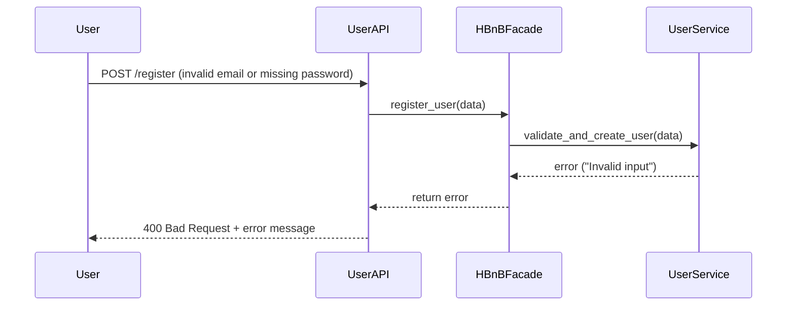

## ❌ API Call: Failed Registration (Invalid Input)

This sequence diagram shows how the system responds when the user provides invalid input during registration.

### Explanation:
1. The **User** submits invalid registration data (e.g., missing password or bad email).
2. The **UserAPI** receives the request and forwards it to the **HBnBFacade**.
3. The **Facade** sends the data to the **UserService** for validation.
4. The **UserService** detects the invalid input and returns an error.
5. The error is passed back through the **Facade** and **UserAPI** to the user as a `400 Bad Request`.
