## ❌ API Call: Review Submission Fails (User Has Not Visited Place)

This sequence diagram shows how the system handles a failed review attempt when the user tries to review a place they have not visited.

```mermaid
sequenceDiagram
    participant 👤 User
    participant 📝 ReviewAPI
    participant 🎯 HBnBFacade
    participant 🧠 ReviewService
    participant 📂 BookingRepository

    User->>ReviewAPI: POST /places/:id/review (rating, comment)
    ReviewAPI->>HBnBFacade: submit_review(data)
    HBnBFacade->>ReviewService: validate_and_create_review(data)
    ReviewService->>BookingRepository: check_if_user_visited_place(user_id, place_id)
    BookingRepository-->>ReviewService: false
    ReviewService-->>HBnBFacade: error ("User has not visited this place")
    HBnBFacade-->>ReviewAPI: return error
    ReviewAPI-->>User: 403 Forbidden + message
```

### Explanation:
1. The **User** submits a review request for a place.
2. The **ReviewAPI** forwards the request to the **HBnBFacade**.
3. The **Facade** calls **ReviewService** to validate the request.
4. The **ReviewService** checks with **BookingRepository** if the user has actually visited the place.
5. If the user hasn't visited, the system returns a `403 Forbidden` error with a message indicating the review is not allowed.
