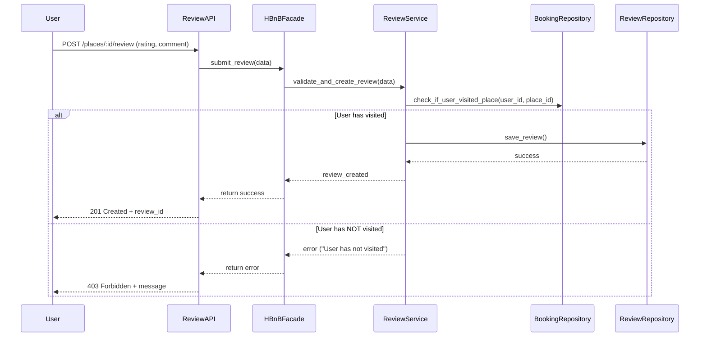

## 🔁 API Call: Review Submission – Success or Fail

This diagram handles both successful and failed review submissions depending on whether the user visited the place.

### Explanation:
1. The **User** submits a review for a specific place.
2. The **ReviewAPI** sends the request to the **HBnBFacade**, which forwards it to **ReviewService**.
3. The **ReviewService** checks with **BookingRepository** whether the user has visited the place.
4. If visited:
   - The review is saved via **ReviewRepository**.
   - A success response is returned with `201 Created` and the review ID.
5. If not visited:
   - The system returns a `403 Forbidden` error, informing the user they can't review the place.
