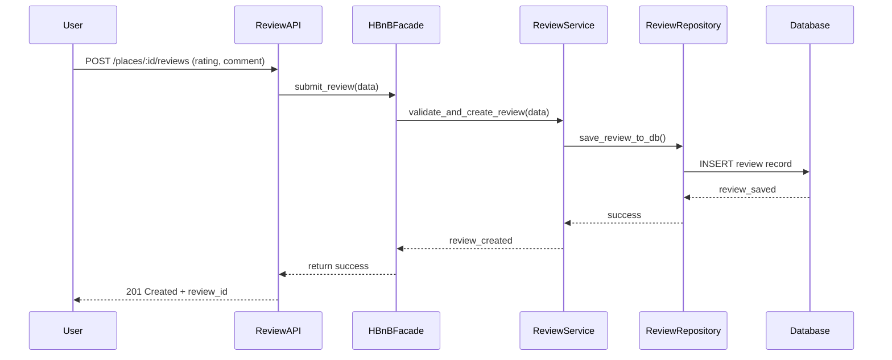

## API Call: Submit Place Review

This sequence diagram demonstrates how a user submits a review for a specific place in the HBnB application. The process starts with the API request and ends with the review being saved in the database.

### Explanation:

1. **User** submits a request to review a place via the API.
2. **ReviewAPI** sends the data to the **HBnBFacade**, which acts as a bridge to the business logic.
3. **HBnBFacade** forwards the data to **ReviewService**, responsible for validation and creation logic.
4. **ReviewService** uses **ReviewRepository** to save the review into the **Database**.
5. Once the database confirms, the success message travels back up to the user with the new review ID.

